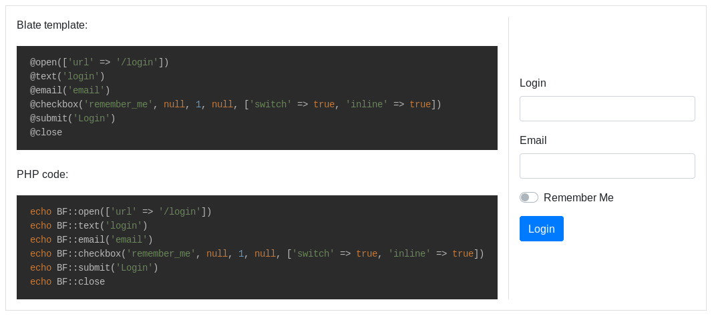

# Bootstrap 4 & 5 forms builder for Laravel 6+ <!-- omit in toc -->

[](https://github.com/bgaze/bootstrap-form/blob/master/LICENSE)


[](https://github.com/bgaze/bootstrap-form/stargazers)


<p style="text-align:center">
    
</p>

This package uses in background [Laravel Collective HTML](https://laravelcollective.com/docs/5.8/html) to simplify
Bootstrap forms creation into Laravel applications.

It renders **Bootstrap 4** markup by default, and supports **Bootstrap 5** as an opt-in (see
[Bootstrap 5 support](#bootstrap-5-support) below): existing applications are not impacted until they opt in.

Model form binding and automatic error display are supported, as well as most of Bootstrap forms features : form
layouts, custom fields, input groups, ...

Any contribution or feedback is highly welcomed, please feel free to create a pull request
or [submit a new issue](https://github.com/bgaze/bootstrap-form/issues/new).

## Documentation

Full documentation and examples are available
at [https://packages.bgaze.fr/bootstrap-form](https://packages.bgaze.fr/bootstrap-form)

If you use **PhpStorm IDE**, you can also
check [this gist](https://gist.github.com/bgaze/1f559782c85511dc2671cdb6b453f0c6) which allow to easily configure **syntax highlighting** 
and **live templates** for this package's custom Blade directives.

## Quick start

Simply install the package using Composer:

```shell
composer require bgaze/bootstrap-form
```

There are a various configuration options available, publish the configuration file to customize them:

```shell
php artisan vendor:publish --provider="Bgaze\BootstrapForm\BootstrapFormServiceProvider"
```

The `BF` facade provides many methods to create forms and inputs:

```html
echo BF::open(['url' => '/my/url', 'novalidate' => true])
echo BF::text('login')
echo BF::email('email')
echo BF::checkbox('remember_me', null, 1, null, ['switch' => true, 'inline' => true])
echo BF::submit('Login')
echo BF::close()
```

Most of them have a Blade directive alias to ease form creation from Blade templates:

```html
@open(['url' => '/my/url', 'novalidate' => true])
@text('login')
@email('email')
@checkbox('remember_me', null, 1, null, ['switch' => true, 'inline' => true])
@submit('Login')
@close
```

## Bootstrap 5 support

Since **v3.0**, the package can render **Bootstrap 5** markup. Bootstrap 4 stays the default, so
**existing applications are not impacted** until they explicitly opt in.

Enable Bootstrap 5 application wide in the published configuration file:

```php
// config/bootstrap_form.php
'bootstrap_version' => 5,
```

Or opt in for a single form (all its fields inherit the version):

```html
@open(['url' => '/my/url', 'bootstrap_version' => 5])
```

Or for a single field:

```html
@text('login', null, null, ['bootstrap_version' => 5])
```

**Vertical** and **horizontal** layouts are fully supported. **Inline** forms are best-effort: Bootstrap 5
reworked the inline layout and it may require additional markup on your side.

The `custom` option (Bootstrap 4 native vs custom controls) is a **no-op** in Bootstrap 5, where custom
controls were merged into the default styles.

### Upgrading from v2 to v3

v3 is backward compatible **at runtime**: with the default `bootstrap_version` (4), the rendered HTML is
unchanged. The only breaking change is the **configuration file structure**: the layout options (`custom`,
`left_class`, `right_class`, `pull_right`, `lspace`, `hspace`, `vspace`) now live under per-version sections.

If you had **published and customized** the configuration file, republish it and move your customizations under
the `bootstrap4` (and/or `bootstrap5`) key:

```shell
php artisan vendor:publish --provider="Bgaze\BootstrapForm\BootstrapFormServiceProvider" --force
```

Applications that never published the configuration file have nothing to do.
