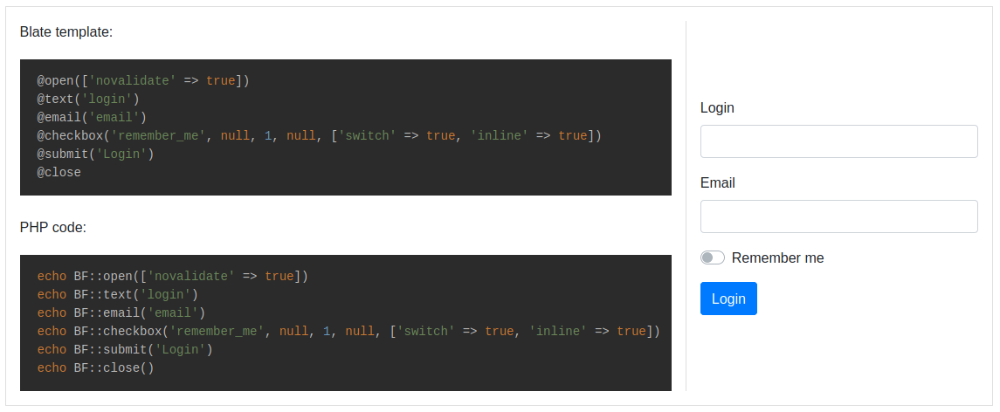

# Bootstrap 4 forms builder for Laravel 5.8+ <!-- omit in toc --> 

[](https://github.com/bgaze/bootstrap-form/blob/master/LICENSE)


[](https://github.com/bgaze/bootstrap-form/stargazers)


<p align="center">
    
</p>

This package uses in background [Laravel Collective HTML](https://laravelcollective.com/docs/5.8/html) to simplify Bootstrap 4 forms creation into Laravel applications.

Model form binding and automatic error display are supported, as well as most of Bootstrap forms features : form layouts, custom fields, input groups, ... 

Any contribution or feedback is highly welcomed, please feel free to create a pull request or [submit a new issue](https://github.com/bgaze/bootstrap-form/issues/new).

## Documentation 

Full documentation and demos are available at [https://packages.bgaze.fr/bootstrap-form](https://packages.bgaze.fr/bootstrap-form)

## Quick start

Simply install the package using Composer:

```shell
composer require bgaze/bootstrap-form
```

There are a various configuration options available, publish the configuration file to customize them:

```shell
php artisan vendor:publish --provider="Bgaze\BootstrapForm\BootstrapFormServiceProvider"
```
  
The `BF` facade provides many methods to create forms and inputs:  

```html
echo BF::open(['url' => '/my/url', 'novalidate' => true])
echo BF::text('login')
echo BF::email('email')
echo BF::checkbox('remember_me', null, 1, null, ['switch' => true, 'inline' => true])
echo BF::submit('Login')
echo BF::close()
```

Most of them have a Blade directive alias to ease form creation from Blade templates:

```html
@open(['url' => '/my/url', 'novalidate' => true])
    @text('login')
    @email('email')
    @checkbox('remember_me', null, 1, null, ['switch' => true, 'inline' => true])
    @submit('Login')
@close
```
